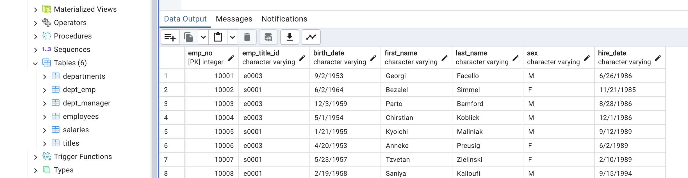

# SQL Challenge

## Description
Designed database to whole six CSVs files containing employees information.  Also, provided analysis on the data.

## Table of Contents
- [Installation](#installation)

- [Credits](#credits)
- [License](#license)
- [Features](#features)

- [Contact](#contact)

## Installation
PostgresSQL

## Credits
Casey Matthews

## License
MIT

## Features
The project provides information about the employees

## Contact
If there are any questions of concerns, I can be reached at:
##### [github: mattcat1221](https://github.com/mattcat1221)
##### [email: caseyvmatthews@gmail.com](mailto:caseyvmatthews@gmail.com)
